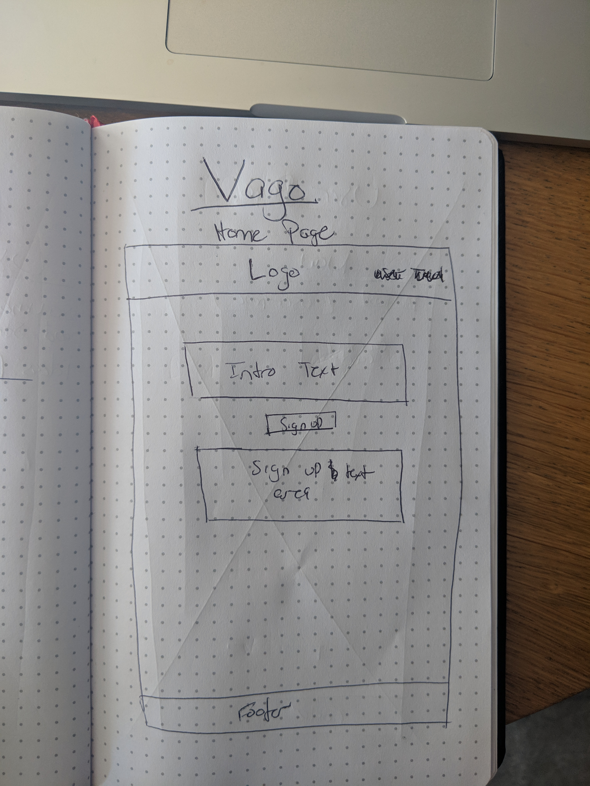
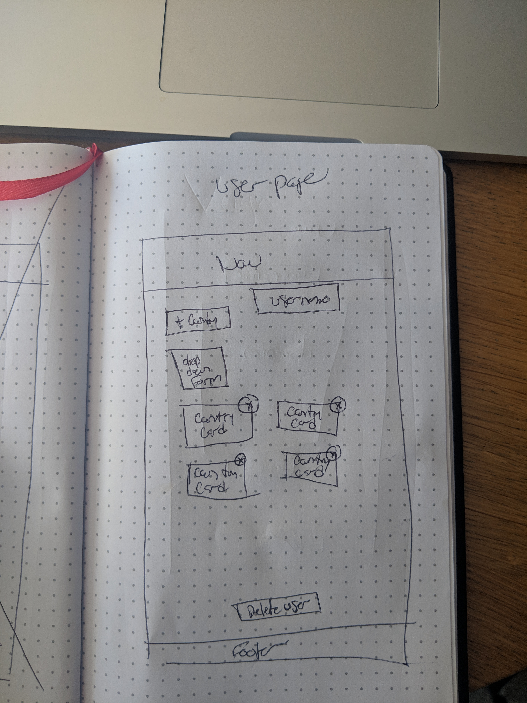
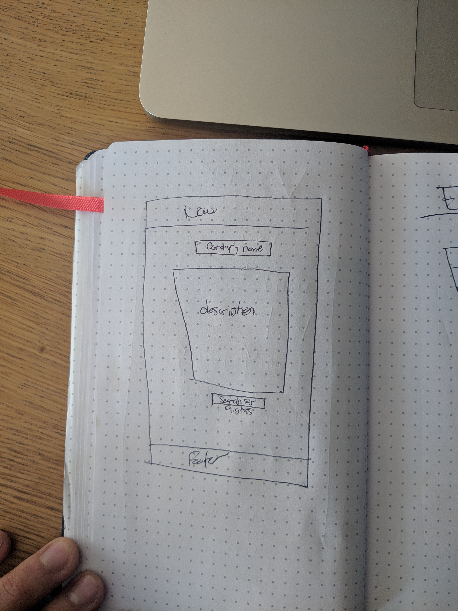
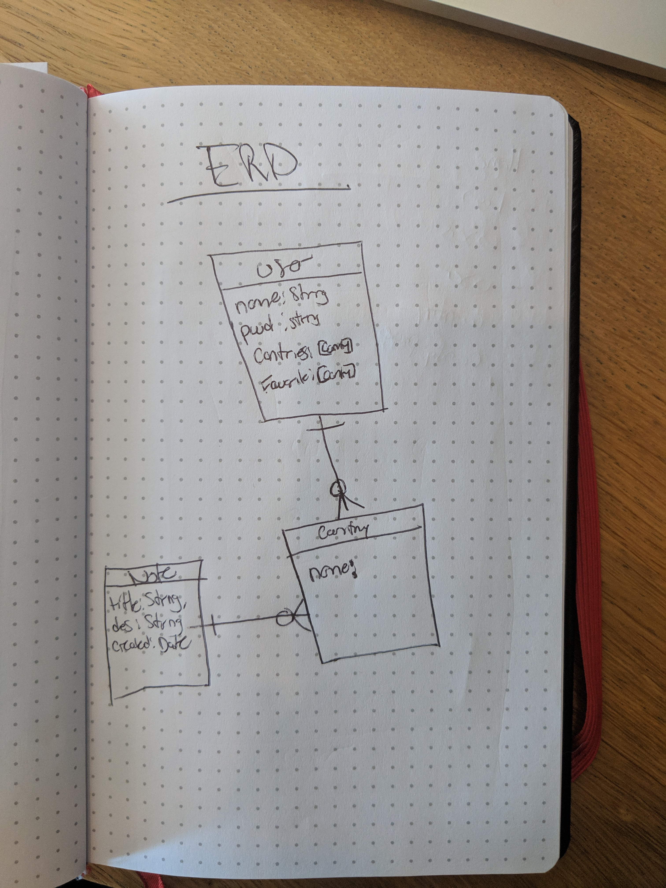

# Vago

Through this application you are able to explore different countries around the world before you book your ticket and go wandering. You can save countries that you want to visit in MongoDB.

[Deployed Heroku Site](https://rocky-sierra-50409.herokuapp.com/)

[Trello](https://trello.com/b/sPnKPtKq/vago)

## Vago Features:

* The user is able to add their name and view their user information.
* The user is able to edit the name of their account
* The user can also delete their account.
* In the application the user can view a profile page where they can add countries they would like to search for.
* The user can click on a country that they would like to view and be forwarded to a country specific view with more information about that country.
* The user can add a certain country to a list of places they would like to visit.
* The user can remove a country if they are no longer interested in visiting.
* The user can click a link to be forwarded to an outside page to view flight information.

## Wireframe:

### Home Page

### User Page

### Country Specific Page

### ERD

## Technologies:

* Languages - Javascript, HTML, and CSS
* Front-End Frameworks - Materialize
* Libraries - React
* Design - Google Fonts and Responsive methodologies
* Visual Studio Code

## Features and Future Improvements:

#### Current Features

* Able to create, read, edit, and delete user
* Able to have single user access to the content
* Able to create, edit, update, and delete a country
* Able to add a country to a list of favorites
* Able to link to an outside site to view flights

___

#### Future Improvements:

* In Version 2 of this application I would like to have a map that drops a pin on each country.

* I would like to have a search for flights option that would take you to site that would direct you to flight options for your trip.

* I would like to have a list of important cultural events happening during a certain time of year you are planning on visiting.

## Credits

Background image photo by Nathaniel Morgan.